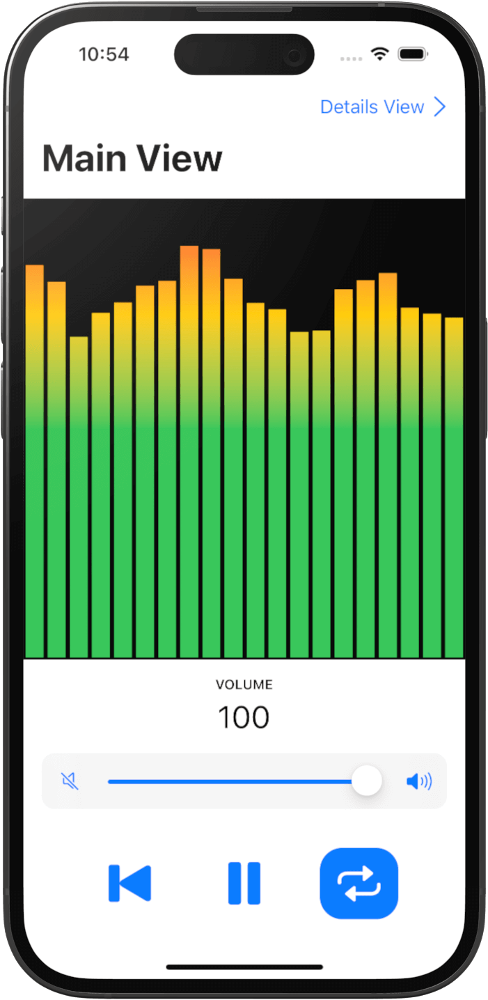

# AKVolumeControl
An Xcode project, demonstrating how to control the volume of an AudioKit audio player via multiple SwiftUI views. [AudioKit](http://audiokit.io/).

## SwiftUI Views and Capabilities:
1. Main View
2. Details View
3. Settings View
4. Light Mode
5. Dark Mode
6. Portrait Mode
7. Landscape Mode

## Installation:
* Within Terminal, cd to your favorite work directory and run `git clone git@github.com:markjeschke/AKVolumeControl.git`. You can also download the [zip](https://github.com/markjeschke/AKVolumeControl/archive/refs/heads/main.zip).
* If you're deploying this app to your physical iOS device, remember to select your developer Team account in the Signing and Capabilities tab in Xcode. Otherwise, you'll receive an error.

### Requirements:
* Minimum target is iOS 15.0. 
* Updated with Xcode 14.2.

### Imported Swift Packages:
* [AudioKit 5.6.0](https://github.com/AudioKit/AudioKit)
* [AudioKitUI](https://github.com/AudioKit/AudioKitUI) (for the level meters)
